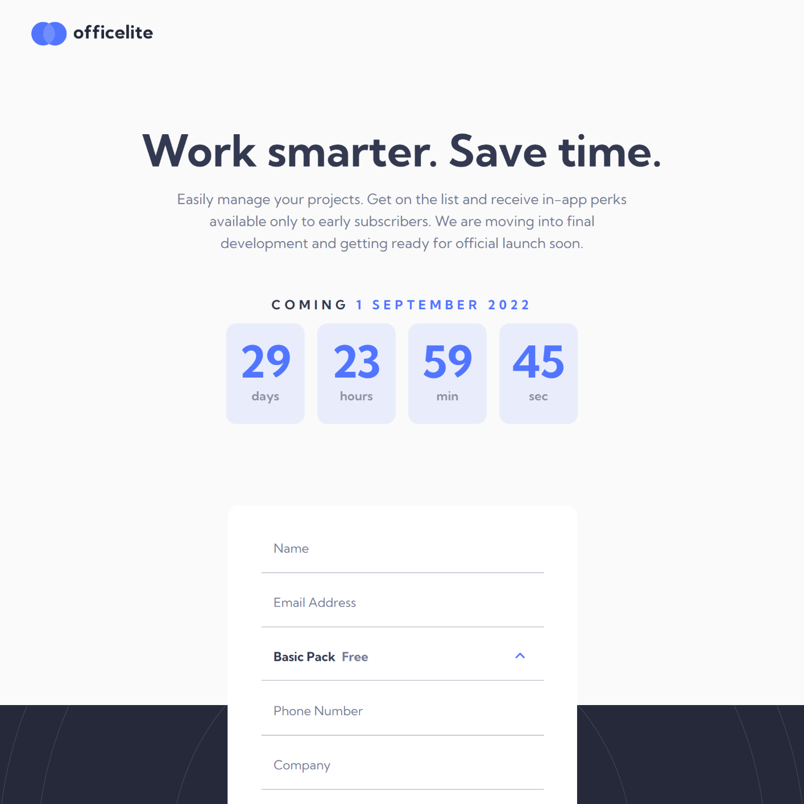

# Frontend Mentor - Officelite coming soon site solution

This is a solution to the [Officelite coming soon site challenge on Frontend Mentor](https://www.frontendmentor.io/challenges/officelite-coming-soon-site-M4DIPNz8g). Frontend Mentor challenges help you improve your coding skills by building realistic projects.

## Table of contents

- [Frontend Mentor - Officelite coming soon site solution](#frontend-mentor---officelite-coming-soon-site-solution)
  - [Table of contents](#table-of-contents)
  - [Overview](#overview)
    - [The challenge](#the-challenge)
    - [Screenshot](#screenshot)
    - [Links](#links)
  - [My process](#my-process)
    - [Built with](#built-with)
    - [What I learned](#what-i-learned)
    - [Continued development](#continued-development)
    - [Useful resources](#useful-resources)
  - [Author](#author)
  - [Acknowledgments](#acknowledgments)

## Overview

### The challenge

Users should be able to:

- View the optimal layout for the site depending on their device's screen size
- See hover states for all interactive elements on the page
- See error states when the contact form is submitted if:
  - The `Name` and/or `Email Address` fields are empty
  - The `Email Address` is not formatted correctly
- **Bonus**: See a live countdown timer that ticks down every second
- **Bonus**: See a custom-styled `select` form control in the sign-up form

### Screenshot



### Links

- Solution URL: [URL](https://www.frontendmentor.io/solutions/officelite-coming-soon-site-with-scss-D8SnNOrIEy)
- Live Site URL: [URL](https://miguelzaga.github.io/officelite-coming-soon-site/)

## My process

### Built with

- JavaScript
- SCSS
- Semantic HTML5 markup
- CSS custom properties
- Mobile-first workflow

### What I learned

- Custom dropdown menus with JS.
- Date objects. Using them appropiately to modify and to render as needed.
- U`sing the local storage directly with JS.

I liked the way I parsed the Date object to use it in the countdown:

```js
function calculateCountdown() {
  var releaseDate = new Date(window.localStorage.getItem("releaseDate"));
  var currentDate = new Date();
  var milisecondsLeft = releaseDate.getTime() - currentDate.getTime();

  var conversionRates = [24 * 60 * 60 * 1000, 60 * 60 * 1000, 60 * 1000, 1000]; // miliseconds in [days, hours, minutes, seconds]

  var parsedCountdown = conversionRates.map(function parseMiliseconds(rate) {
    var convertedValue = Math.floor(milisecondsLeft / rate);
    milisecondsLeft = milisecondsLeft % rate;
    return convertedValue;
  });

  // [daysLeft, hoursLeft, minutesLeft, secondsLeft] = parsedCountdown;
  return parsedCountdown;
}
```

### Continued development

I want to improve in my usage of Local Storage and Date Objects.

### Useful resources

- [Developing custom dropdowns with vanilla JS & CSS (In under 5 minutes)](https://medium.com/@kyleducharme/developing-custom-dropdowns-with-vanilla-js-css-in-under-5-minutes-e94a953cee75) - I adapted this code to create the custom dropdown.
- [Meta Tags](https://metatags.io/) - I generated the meta tags with this website.
- [Date.prototype.setTime](https://developer.mozilla.org/en-US/docs/Web/JavaScript/Reference/Global_Objects/Date/setTime) - I was able to do the countdown with these docs.

## Author

- Website - [Miguel Zapata](https://miguezaga.online/)
- Frontend Mentor - [@miguelzaga](https://www.frontendmentor.io/profile/miguelzaga)

## Acknowledgments

I want to thank @kyleducharme because of his article on custom dropdowns. It was informative and helpful, I was able to understand his code and it is amazing.
